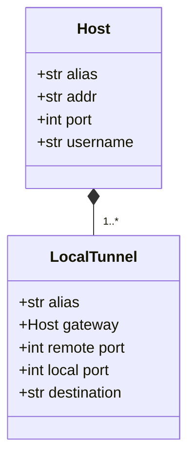
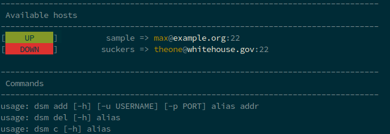

# The damn ssh manager

## Why?

It looks like, that it is really hard to find a ssh connection managing instance for the terminal, that just saves ssh connection details through an alias. There is the [`.ssh/config`](https://linuxize.com/post/using-the-ssh-config-file/) where one can of course enter various configuration settings to store ssh connections. How to list all hosts inside this file, so you don't have to remember all of them:

```shell
sed -rn ‘s/^\s*Host\s+(.*)\s*/\1/ip’ ~/.ssh/config
```

Maybe this list does not meet the requirements of the developer/admin. So there it is. A python script that stores ssh connection details. You can even run ssh connections and local tunnels with it ... hell yeah! All your configurations are stored inside the user configuration home directory (for example `$HOME/.config/damnsshmanager`) inside some pickle files. `hosts.pickle` is the root of all. Nothing runs without hosts. Local tunnels are based on these hosts, so the following diagram meets these conditions.



It is all based on a single small file in your home directory called ``hosts.pickle`` and ``localtunnels.pickle`` under the directory ``damnsshmanager``. One host contains simply the attributes as does the tunnels. Local tunnels are based on saved hosts! No hosts means no local tunnels, so just create one. This way you don't have to specify multiple host connections for every new tunnel. The gateway is equal to the alias used to define the host connection.

Example:

```shell
dsm add foo some.strange.host -u hero
dsm ltun --destination example.com bar foo 80
dsm c bar
```

The first command creates a connection to the strange host. The second one adds a tunnel that runs on example.com to the remote port 80 of the strange host. A local port is, if not specified, automatically chosen by the manager. The last command opens the tunnel. On normal ssh this would mean ``ssh -L 49152:example.com:80 hero@some.strange.host``. Local port range is from 49152 til 65535.

There is a [great description](https://blog.trackets.com/2014/05/17/ssh-tunnel-local-and-remote-port-forwarding-explained-with-examples.html) on how ssh tunnels work.

At the moment this thing handles no more data! It is *developed* just for this simple reason.

## Installation

### via pip

```shell
pip install damnsshmanager
```

### from sources

Please install [python-poetry](https://python-poetry.org) for this to work.

```shell
git clone https://github.com/captain-proton/damnsshmanager

cd damnsshmanager

poetry build && poetry install
```


Usage
=====

With the installation comes the script `dsm`.

```shell
dsm -h
```

| Action  |                              Description                               |
| ------- | ---------------------------------------------------------------------- |
| add     | `dsm add <alias> <hostname> [-u username] [-p port]`                   |
| ltun    | `dsm ltun <alias> <gateway> <remote port> [local_port] [destionation]` |
| delete  | dsm del <alias>                                                        |
| connect | dsm c <alias>                                                          |

When run without parameters all saved instances are tested.


