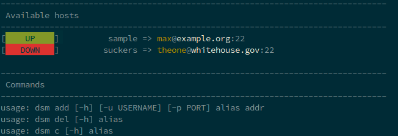

********************
The damn ssh manager
********************

Why?
====

It looks like, that it is really hard to find a ssh connection managing instance that just saves ssh connection details through an alias. I am not able to remember all the hosts that I am responsible for, therefore a manager is needed. One may say ... "Dude, do this shit in (ba)sh! ... stupid". But for me shell scripting is, in most of the cases, just an annoying task.

So there it is. A python script that stores ssh connection details. You can even run ssh connections with it ... hell yeah! It is all based on a single small file in your home directory called ``hosts.pickle`` under the directory ``damnsshmanager``. One host contains simply the attributes

- ``alias``
- ``addr``
- ``port``
- ``username``

At the moment this thing handles no more data! It is *developed* just for this simple reason.

Installation
============

via pip
-------

.. code-block:: shell

    pip install damnsshmanager

from sources
------------

.. code-block:: shell

    git clone https://github.com/captain-proton/damnsshmanager

    cd damnsshmanager

    python3 setup.py install

Usage
=====

With the installation comes the script ``dsm``.

.. code-block:: shell

    dsm -h

+---------+--------------------------------------------------------+
| Action  | Command                                                |
+=========+========================================================+
| add     | ``dsm add <alias> <hostname> [-u username] [-p port]`` |
+---------+--------------------------------------------------------+
| delete  | dsm del <alias>                                        |
+---------+--------------------------------------------------------+
| connect | dsm c <alias>                                          |
+---------+--------------------------------------------------------+

When run without parameters all saved instances are tested.

